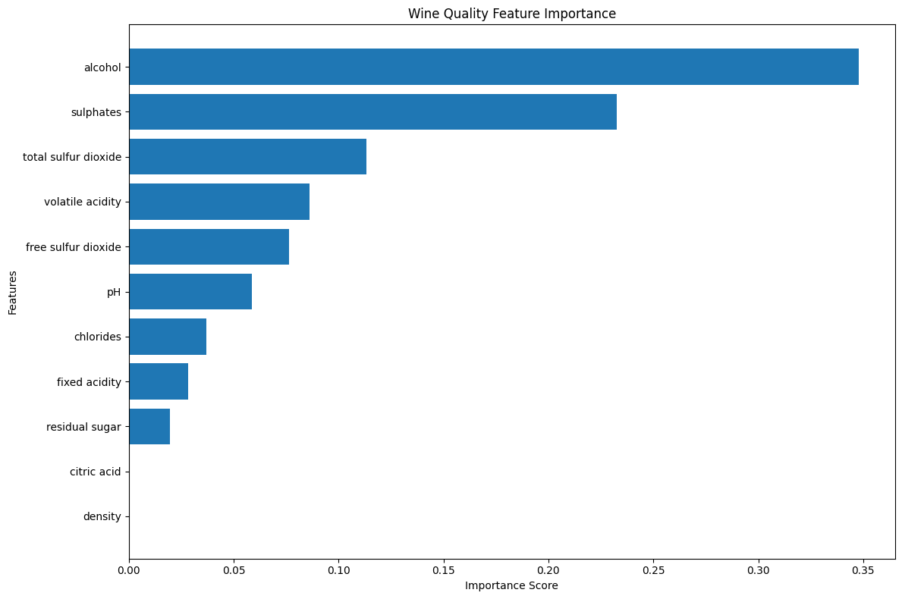

# Wine Quality Prediction

## Project Overview
This machine learning project predicts wine quality based on physicochemical properties.

## Algorithms Used
- Logistic Regression
- KNN
- Decision Tree

## Best Model
Tuned Decision Tree

## Accuracy
89.68%

## Technologies
- Python
- Pandas
- NumPy
- Scikit-Learn
- Matplotlib
## Feature Importance

## Dataset
Wine Quality Dataset

## Author
Hemanth Reddy Saddi
